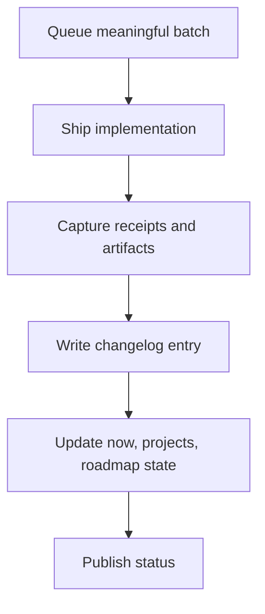

This site publishes two kinds of operational writing:

## Changelog = what shipped

Use changelog entries to record concrete production changes.

**Required for every meaningful PR.**

Keep entries factual and concise:
- Added / Changed / Fixed
- Impact statement
- Links to PR/commit when useful

If someone asks *"what changed?"*, the changelog should answer it fast.

## Field notes = what we learned

Use field notes to capture process insight from real work.

Publish a field note every 2–4 PRs, or any time there’s a notable debugging session or decision.

Good field notes include:
- context and goal
- friction/surprises
- tradeoffs and rationale
- what we’d do differently
- next experiment

If someone asks *"why did you do it this way?"*, field notes should answer that.

## Cadence

- Every meaningful PR → changelog entry
- Every 2–4 PRs (or notable incident) → field note
- `/pages/now` reviewed every merged PR batch; update when weekly priorities change
- Weekly hard refresh of `/pages/now` (rewrite focus, not just typo edits)
- Monthly → recap post synthesizing both

## Execution flow (rendered)

## Architecture maps (simple/deep)

<section class="architecture-maps card" id="architecture-maps" aria-labelledby="architecture-maps-heading">
  <h3 id="architecture-maps-heading">Execution architecture maps</h3>
  
Simple view is for quick scan. Deep view adds operational detail for implementation/debug context.

  

    <button type="button" class="chip is-active" data-arch-view="simple" aria-pressed="true">Simple view</button>
    <button type="button" class="chip" data-arch-view="deep" aria-pressed="false">Deep view</button>
  

  

    <pre class="mermaid" aria-label="Simple execution architecture map">
flowchart LR
  Q[Scoped batch] --> I[Implement]
  I --> R[Receipts]
  R --> C[Changelog]
  C --> S[State sync]
  S --> P[Publish status]
    </pre>
  

  

    <pre class="mermaid" aria-label="Deep execution architecture map">
flowchart TB
  A[HEARTBEAT queue + STATE + roadmap] --> B[Select one meaningful batch]
  B --> C[Implement on main]
  C --> D[Capture before/after artifacts]
  D --> E[Write changelog receipt]
  E --> F[Update STATE + HEARTBEAT + now/projects]
  F --> G[Report concise shipped status]
    </pre>
  

</section>

## Publish-time policy

Default all post/changelog/note timestamps to **now** (or slightly in the past) so merged content appears immediately.

Only use future-dated timestamps when intentionally scheduling publication.

## Anti-pattern

Don’t duplicate changelog text in field notes.

Field notes should add insight, not repeat facts.

Also avoid duplicate posts for the same period/topic. Update the canonical post and use aliases when URL changes.
